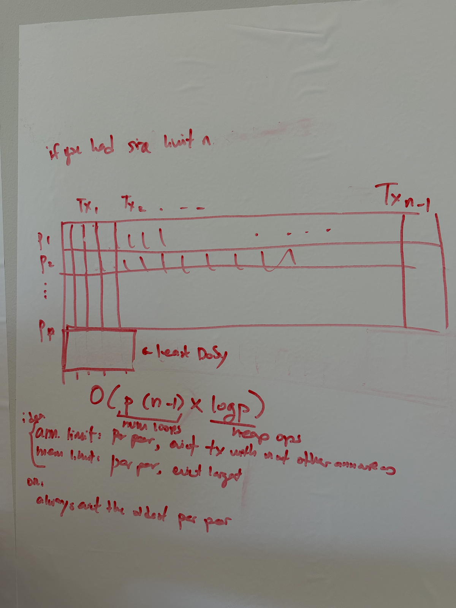

* Goal: Make 1p1c more reliable
    * In worst case currently is ability to protect 24 packages
    * TRUC only? We know its 1p1c and also ~small child
* The whole idea is that sender initiated doesn't relay on the orphanage
    * “If we can avoid the orphanage, we should. If we can avoid it we have
      better propagation properties”
    * Orphanage is less load bearing, less churn
* Handshake “I understand sender initiated”
* If we have not sent the parent, then send the package
* Packages are all chunks in a cluster mempool future?
    * What about replacements? Gets into package RBF territory
* Wasting bandwidth
    * when there’s a conflict, or you wouldn’t take it due to RBF
* What happens when the high fee child is being replaced?
    * Does sender know the receiver still has the parent?
        * Still have the orphanage as fallback
        * Can fall back to receiver initiated
* Limits?
    * Package RBF your package, knock it out, sender won’t send again, will INV
      a new high fee. But someone else will send it to you
* 2 minute expiry discussion
    * Why is it 2 minutes? Motivation? Historical
    * Measure how long transactions requests take, per peer. Use that number to
      influence expiry and prioritize peers
    * Expiry is more important than delay
    * Should consider variable tx request expiry
        * Consider inbound/outbound, other factors
    * &lt;Needs input!>
* Consideration around peer’s feefilter 
* New orphan limits
    * 3000 global announcement limit, regardless of number of peers
        * If no global limit is reach, no eviction
        * Preventing one peer from influencing what you think about another peer
    * 404,000 wu per peer -> memory?
    * Pick DoS-y-est peer and evict announcement from them
        * Announcement per peer (global / # of peers)
        * Memory usage per peer
        * Actual use vs reservation is the DoSy score
        * One you have Dosiest peer, sort txs
            * Idea: if you hit limit, you evict a tx that has been announced by
              many peers. Maximizing variety.
            * Remove oldest?
* Segwit vs non considerations?
    * 2 minute withholding attack relies on the transaction being non-segwit
      (some more discussion how Greg is actually wrong)
* Martin Attack
    * Per-peer DoS limits are circumvented if the attacker can make other, good
      peers provide the orphans to the victim
    * Can be done by inv-announcing  the parent to the victim (but not providing
      it, so 2 minutes timeout) and providing parent+child to the rest of the
      network, so that other peers will relay the child to the victim, which if
      repeated can be used to fill up orphanage / trigger random eviction of
      other random orphans.
    * Only works temporarily, and comes with a cost (must use valid transactions
      that may mined)  
* How to test?
    * Warnet simulation
* Gloria’s list of todos
    * From whiteboard

