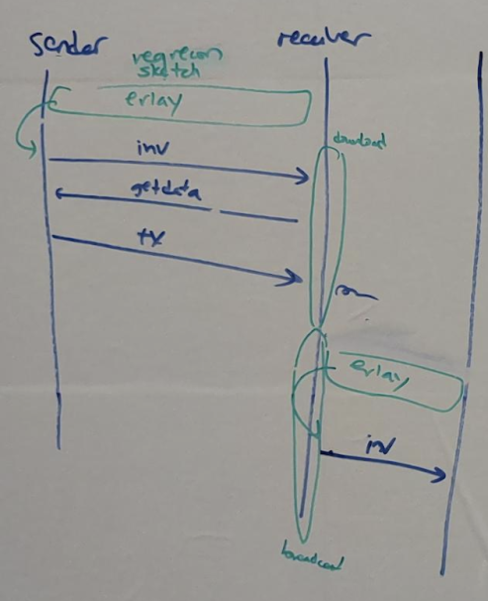
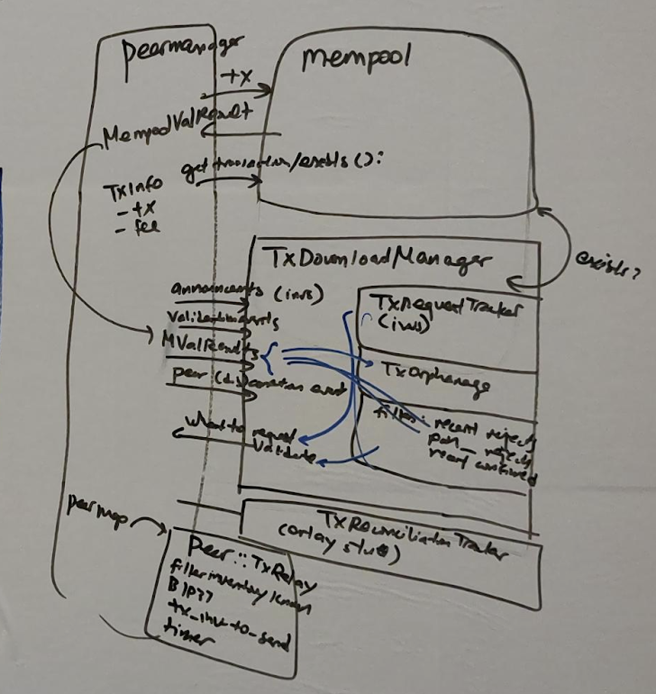

part 1. tx download vs upload/broadcast are totally separate pieces of code and logic

- download: deciding what to download from our peers. everything from receipt of invs to submitting to mempool.
- upload: deciding what to inv to peers (90% of the code), and responding to getdatas (just a few lines).
- where Erlay fits in here: BEFORE they send us an inv, we may do a sketch / set reconciliation before they decide what to inv us. BEFORE we trickle invs, we do a sketch / set reconciliation before deciding what to send.
- The only place where there is overlap: if ForceRelay permissions, we immediately forward a tx for broadcast when we receive it

part 2. overall modules/architecture

part 3. Code tour for codepaths:

- inv - getdata - tx
- tx (unsolicited)
- inv - getdata - notfound
- inv - getdata - stall
- tx - valid
- tx - invalid
- 1p1c
- full package relay / post cluster mempool:
  - 27742?
  - how it fits into architecture we drew in part 2
